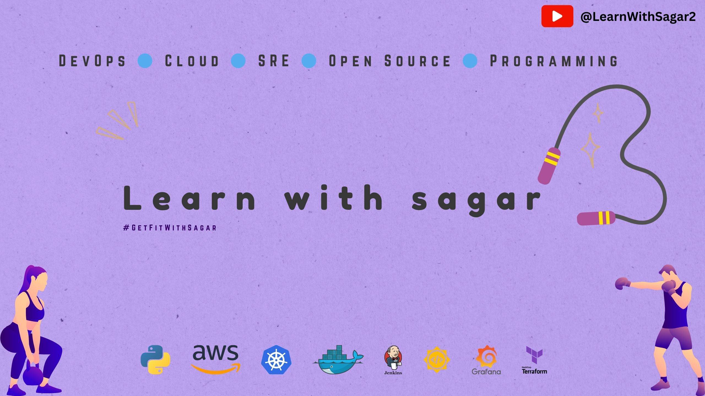

 
 

### Hi there, I'm Sagar Utekar 😃👋
Hi, meet Sagar Utekar, YouTuber - @LearnWithSagar2, and an experienced Site Reliability Engineer @VMWare and Technical Trainer, fitness enthusiast, passionate about teaching (DevOps, SRE, Cloud, Open Source).

My vision is to provide top notch education for free/minimal cost to help learners to transition their career into IT, irrespective of their background. 

Sagar will be teacher, trainer, coach , mentor. He has over 6+ years of experience and feels proud and honoured to train more than 8000+ learners to get their dream jobs in IT.

Sagar is also Docker Pune, CNCF Pune & Grafana Pune community leader.

### 🔍 Interests

* Go / Python / Shell Scripting
* Container & Kubernetes Administration + Security
* Cloud Native
* Open Source
* DevOps
* Infrastructure as a Code (IaaC)
* Site Reliability Engineering (SRE)

### ✈️ Get in touch

<h3 align="left">Connect with me:</h3>

  

### Tools 

<h3 align="left">Version Control System :</h3>

  

<h3 align="left">Languages :</h3>
 

<h3 align="left">Languages and Tools:</h3>

 
## Containerisation tools
## Infrastructure management tools

## Programming Language

### Blog links
<!-- BLOGPOSTS:START -->
 - 🚀 [Git and Github](https://getfitwithsagar.hashnode.dev/git-and-github)
 - 🚀 [What is #getfitwithsagar](https://getfitwithsagar.hashnode.dev/what-is-getfitwithsagar)<!-- BLOGPOSTS:END -->

📈 my github stats

 

[Credly Link](https://www.credly.com/users/sagar-utekar/badges)

Upcoming projects :

